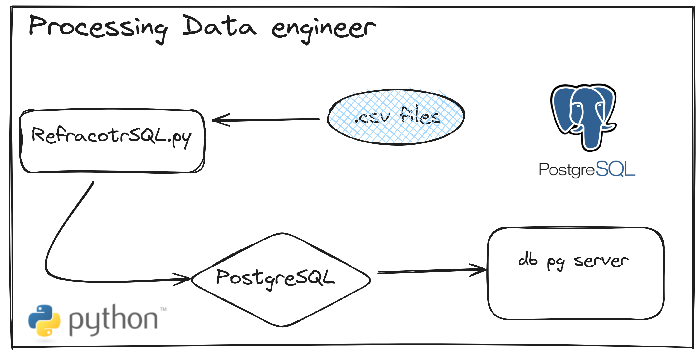

## Projeto olist analisando dados de um E-commmercer


## Processo de manipulação de arquivos .csv para sql 



Configurando variaveis de ambiente arquivo `.env` 
```python
# configurando as variáveis de ambiente no postgreSQL
USER_NAME = ""
PASSWORD = ""
HOST_NAME  =  ""
PORT = ""
DATABASE = "" 
```

Você deve passar as configurações do banco de dados postgreSQL que você têm instalado em sua máquina
se você não sabe nada sobre SQL e postgreSQL acesse -> <a href="https://www.postgresql.org/">postgreSQL</a> 


